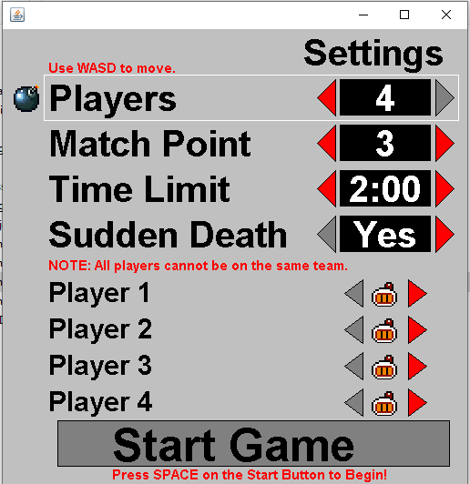
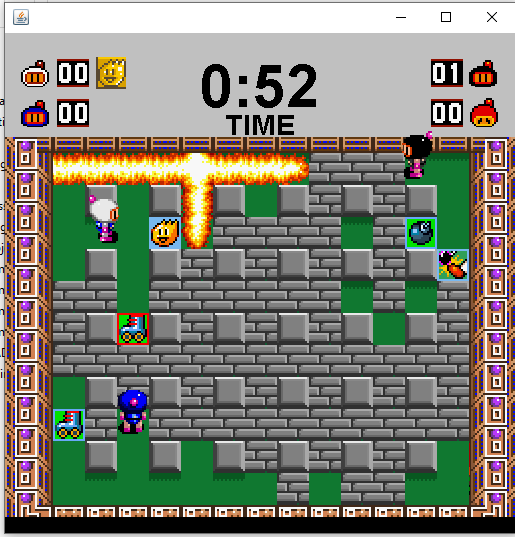

# Bomberman
Recreated the classic game. Sprites were taken off from the internet.
Instructions on how to play can be found in the BombManInstructions.txt

This project used to use Java Applets, however applets have been deprecated on web browsers for a while.
I went back and switched to the Swing Library so that I can export this as an executable jar.
You should be able to run the game through the BomberMan.jar, assuming you have Java set up correctly.
I should work on the latest Java (Java 17.0.1, as of writing)

Possible next steps of this project would be to have controls be configurable, add sound. Adding a simple CPU would also be cool.